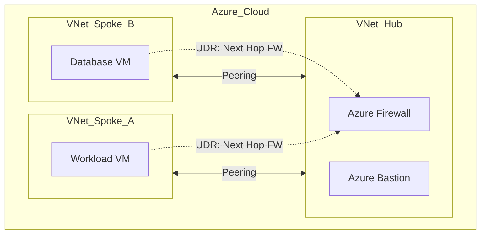

# Azure Secure Hub-and-Spoke Infrastructure

## Descripción
Este proyecto despliega una topología de red Hub-and-Spoke segura en Microsoft Azure. 

## Objetivos Técnicos
* Implementar una **VNet Hub** centralizada con **Azure Firewall**.
* Configurar **VNet Peering** entre redes aisladas (Spokes).
* Controlar el flujo de tráfico mediante **User Defined Routes (UDR)**.
* Asegurar el acceso mediante **Azure Bastion**.

## Arquitectura

## 📋 Especificaciones de la Red
Modelo **Hub-and-Spoke**, centralizando la seguridad en el Hub para optimizar costes y control.

### Esquema de Direccionamiento IP
| Componente   | VNet Range    | Subnet                | IP Range      | Rol                    |
| :----------- | :------------ | :-------------------- | :------------ | :--------------------- |
| **Hub VNet** | `10.0.0.0/16` | `AzureFirewallSubnet` | `10.0.1.0/24` | Inspección de tráfico  |
|              |               | `AzureBastionSubnet`  | `10.0.2.0/24` | Acceso seguro (PaaS)   |
| **Spoke A**  | `10.1.0.0/16` | `snet-workload`       | `10.1.1.0/24` | Aplicaciones / Cómputo |
| **Spoke B**  | `10.2.0.0/16` | `snet-database`       | `10.2.1.0/24` | Capa de Datos          |

### 🛡️ Flujo de Seguridad (East-West)
Todo el tráfico entre el **Spoke A** y el **Spoke B** es forzado hacia la IP privada del Azure Firewall (`10.0.1.4`) mediante **Rutas Definidas por el Usuario (UDR)**. 

1. El tráfico sale de la VM en Spoke A.
2. La **UDR** intercepta el paquete y lo envía al Firewall en el Hub.
3. El Firewall aplica las **Network Rules** y, si es autorizado, lo encamina al Spoke B.

## 🚀 Resumen del Proyecto
Infraestructura de red de alta seguridad en Azure configurada íntegramente como Código (IaC).

### Capacidades Implementadas:
* **Segmentación L3/L4:** Control de tráfico mediante Azure Firewall Policy.
* **Enrutamiento Forzado (Next-Hop):** Tablas de rutas (UDR) que garantizan que ningún paquete entre Spokes evite la inspección.
* **Topología Hub-and-Spoke:** Aislamiento total de la capa de datos (Spoke B) respecto a la capa de cómputo (Spoke A).
* **Gestión Segura:** Subredes dedicadas para Azure Bastion y Gateway.
