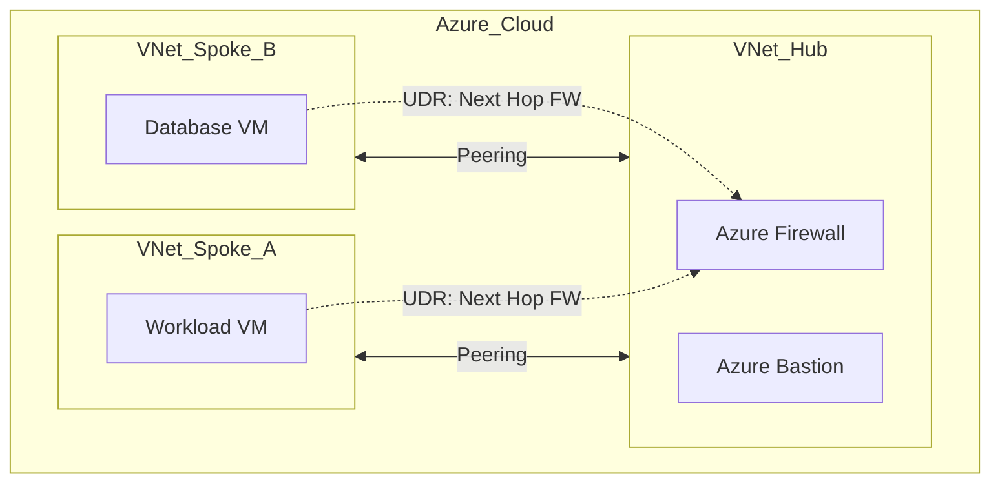
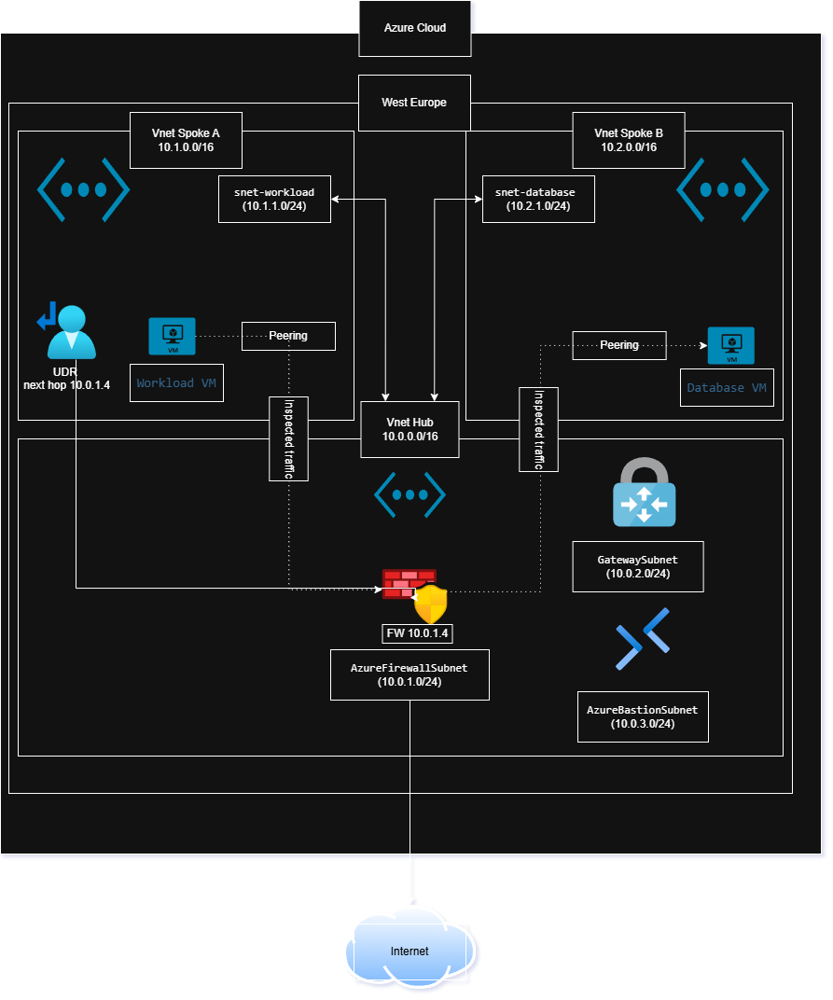

# Azure Secure Hub-and-Spoke Infrastructure

## Descripción
Este proyecto despliega una topología de red Hub-and-Spoke segura en Microsoft Azure. 
Está diseñado como parte de mi preparación para la certificación **AZ-104**.

## Objetivos Técnicos
* Implementar una **VNet Hub** centralizada con **Azure Firewall**.
* Configurar **VNet Peering** entre redes aisladas (Spokes).
* Controlar el flujo de tráfico mediante **User Defined Routes (UDR)**.
* Asegurar el acceso mediante **Azure Bastion**.

## Arquitectura

